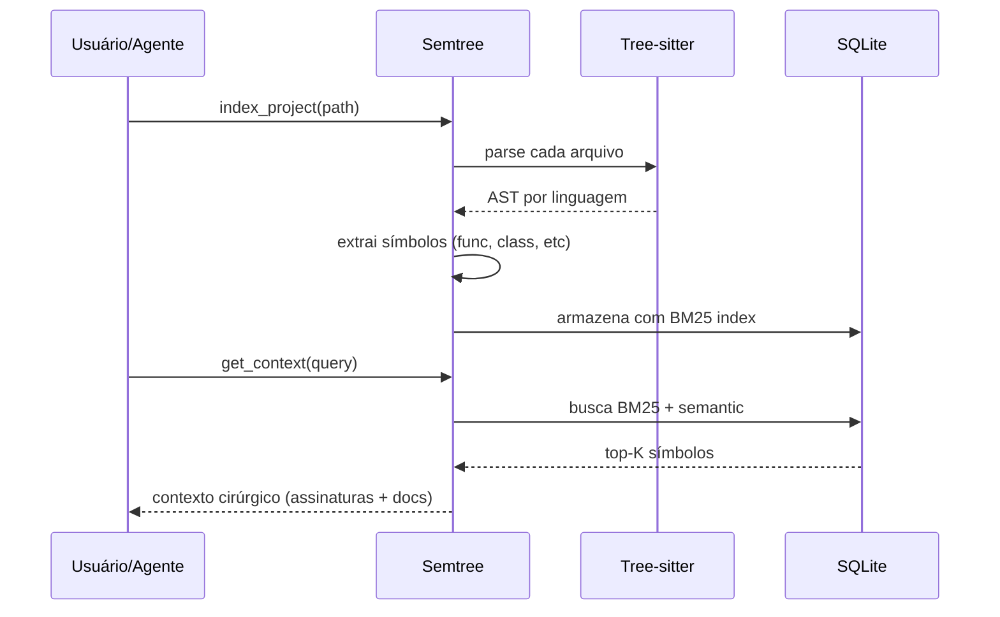

# Como funciona

## Visão geral



## Fases

### 1. Indexação

Tree-sitter parseia cada arquivo do projeto na linguagem detectada. Suporta:

- Python (.py)
- TypeScript / JavaScript (.ts, .tsx, .js, .jsx)
- Go (.go)
- Rust (.rs)
- Ruby (.rb)
- Java (.java)
- C / C++ (.c, .cpp, .h)

Para cada arquivo, o indexer extrai:

- Funções e métodos (com assinatura completa)
- Classes (com métodos públicos)
- Constantes exportadas
- Imports / dependencies
- Docstrings / JSDoc / rustdoc

### 2. Armazenamento

Tudo vai pra SQLite local em `.semtree/index.db`:

```sql
CREATE TABLE symbols (
    id INTEGER PRIMARY KEY,
    name TEXT NOT NULL,
    kind TEXT NOT NULL,  -- function, class, method, constant
    file_path TEXT,
    line_start INTEGER,
    line_end INTEGER,
    signature TEXT,
    docstring TEXT,
    language TEXT
);

CREATE VIRTUAL TABLE symbols_fts USING fts5(
    name, signature, docstring,
    content='symbols', content_rowid='id'
);
```

Índice FTS5 nativo do SQLite dá busca BM25 sem dependências extras.

### 3. Retrieval

Quando o agente chama `get_context(query)`:

1. Query é normalizada e tokenizada
2. BM25 retorna top-K matches do FTS5
3. Reranking opcional via embeddings (se configurado)
4. Resposta inclui só assinatura + docstring (sem corpo de função)

Custo: tipicamente **200-500 tokens** para uma query que renderia 50.000+ tokens se você colasse os arquivos.

## Trade-offs

| Aspecto | Semtree | Alternativa (Greptile, Cody) |
|---------|---------|------------------------------|
| Custo | $0 (local) | SaaS pago |
| Privacidade | Seu código nunca sai da máquina | Sobe pra servidor remoto |
| Setup | `pip install semtree` | API key + cadastro |
| Personalização | Open source, hackável | Caixa preta |
| Cobertura | Símbolos estruturais | Full text + AI rerank |

Para times pequenos / projetos abertos, Semtree é suficiente. Para empresas grandes com necessidade de busca semântica profunda + colaboração, soluções SaaS valem o custo.

## Por que tree-sitter

- **Rápido**: parser incremental em C, 10-100x mais rápido que LSP
- **Multi-linguagem**: gramáticas mantidas pela comunidade
- **Estrutural**: extrai forma, não só texto
- **Sem dependências de runtime**: não precisa do compilador/interpretador da linguagem

Ver [Por que tree-sitter](tree-sitter.md) para mais detalhes.
