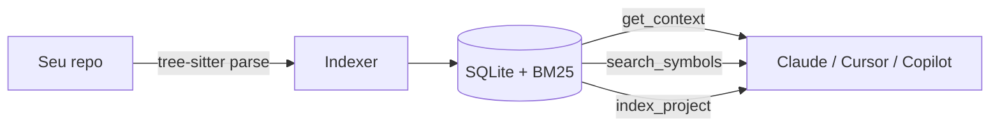

# Semtree

**Contexto otimizado para AI assistants.** Indexação semântica de código fonte para Claude Code, Cursor, Copilot e Codex.

[](https://pypi.org/project/semtree/)
[](https://www.python.org/)
[](https://github.com/nikolasdehor/semtree/blob/main/LICENSE)

## O problema

Você cola arquivos inteiros no Claude/Cursor/Copilot. O assistente "vê" tudo, mas a maior parte é ruído: imports, código que não importa para a tarefa, classes inteiras quando você só precisa de uma assinatura. Resultado: tokens desperdiçados, respostas mais lentas, custo maior.

## A solução

O Semtree usa **tree-sitter** para parsear seu código fonte e extrair apenas o que importa: assinaturas, docstrings, dependências, símbolos relevantes. Entrega contexto cirúrgico via MCP.



## Resultado prático

- Respostas mais rápidas (menos tokens para o modelo processar)
- Sugestões mais precisas (sinal/ruído maior)
- **Até 87% de redução no uso de tokens contextuais**

## Quick start

```bash
pip install semtree

# Indexa o projeto atual
semtree index .

# Vê o contexto que seria entregue ao agente
semtree context "implementar paginação no endpoint X"
```

## Integração com Claude Code

Adicione em `claude_desktop_config.json`:

```json
{
  "mcpServers": {
    "semtree": {
      "command": "semtree",
      "args": ["mcp"]
    }
  }
}
```

Reinicie o Claude. Use em qualquer pergunta:

> "Use o semtree para ver o contexto desse repo e me ajude a refatorar a função X"

## Onde ir agora

[:material-rocket: Comece pelo guia rápido](getting-started/quickstart.md){ .md-button .md-button--primary }
[:material-school: Como funciona](concepts/how-it-works.md){ .md-button }
[:material-github: Ver no GitHub](https://github.com/nikolasdehor/semtree){ .md-button }
